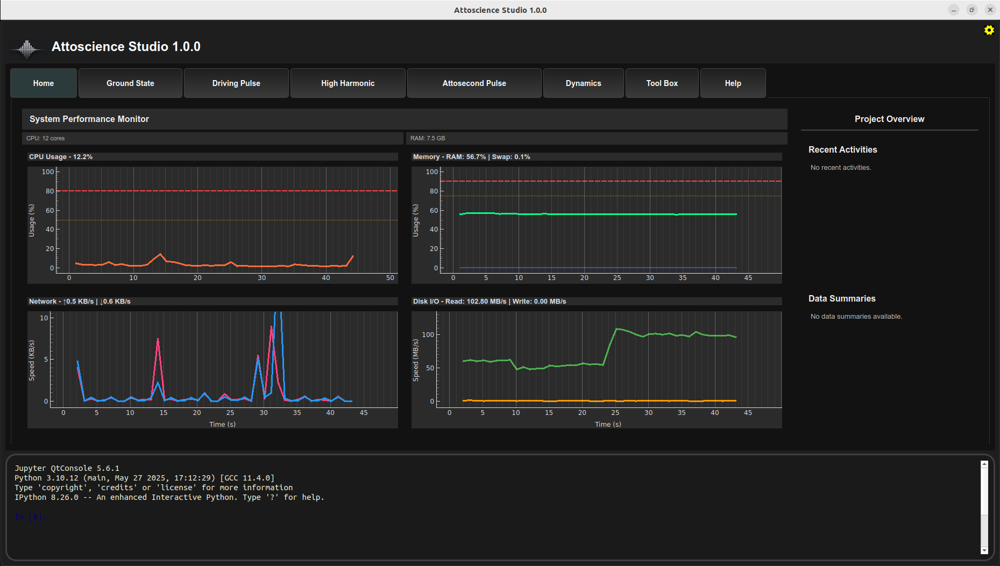
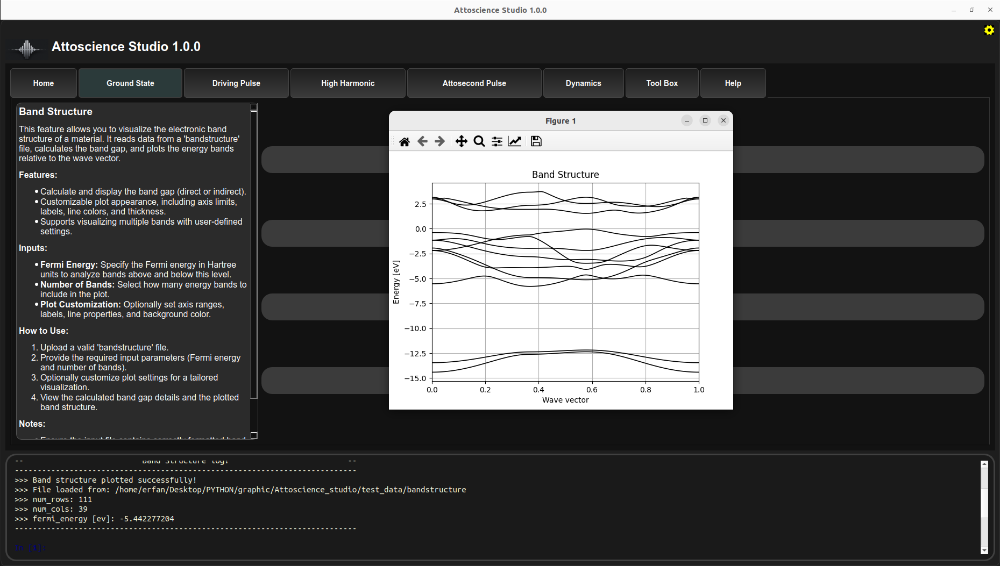
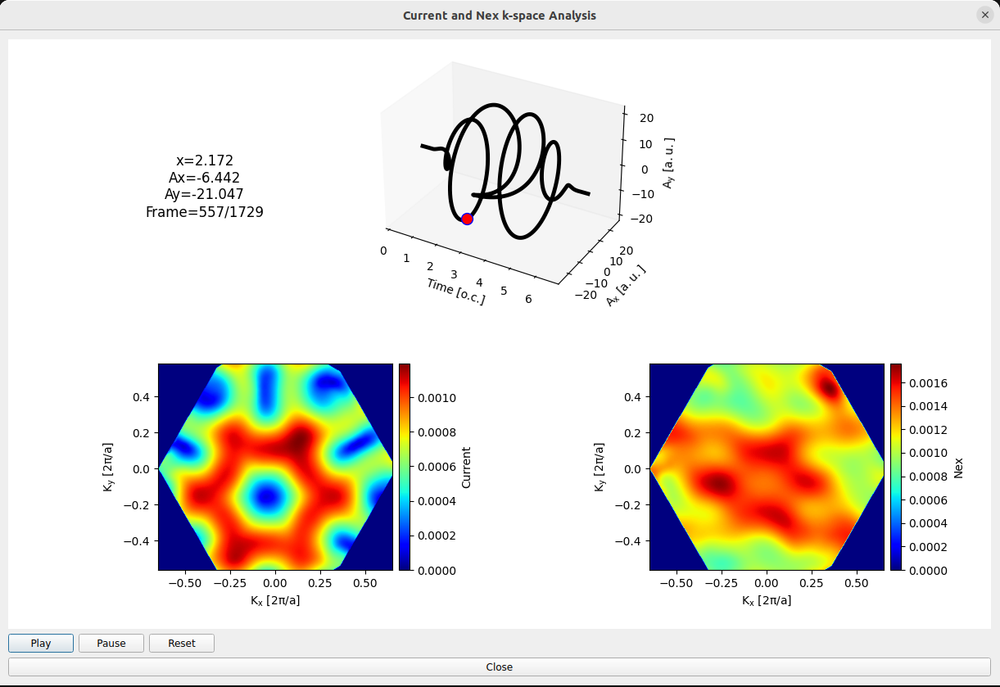
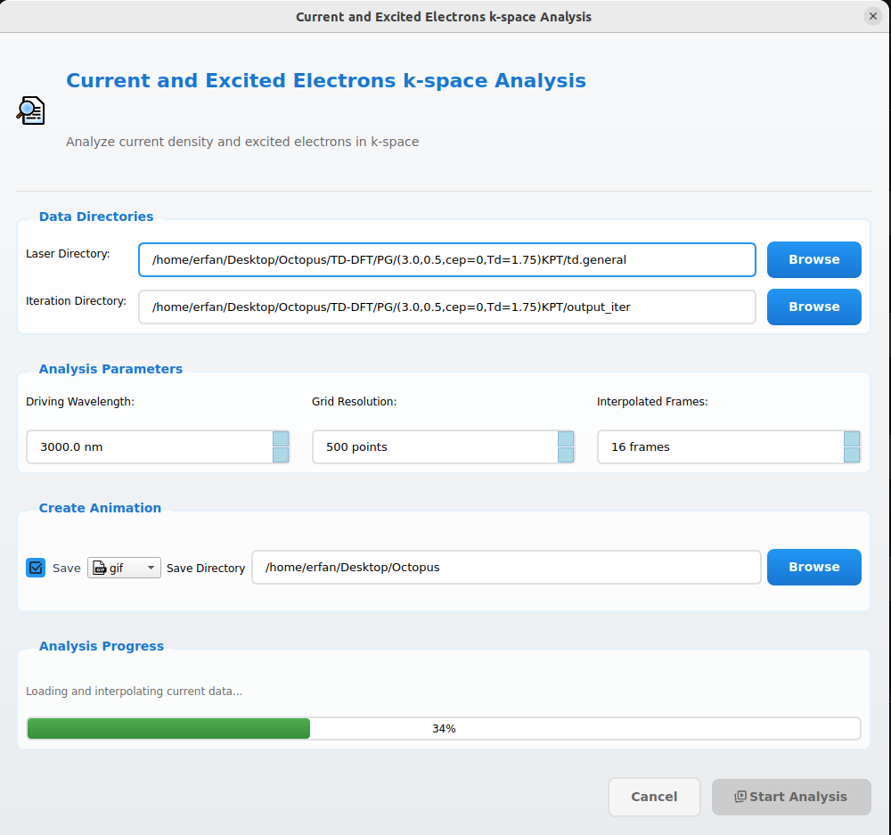
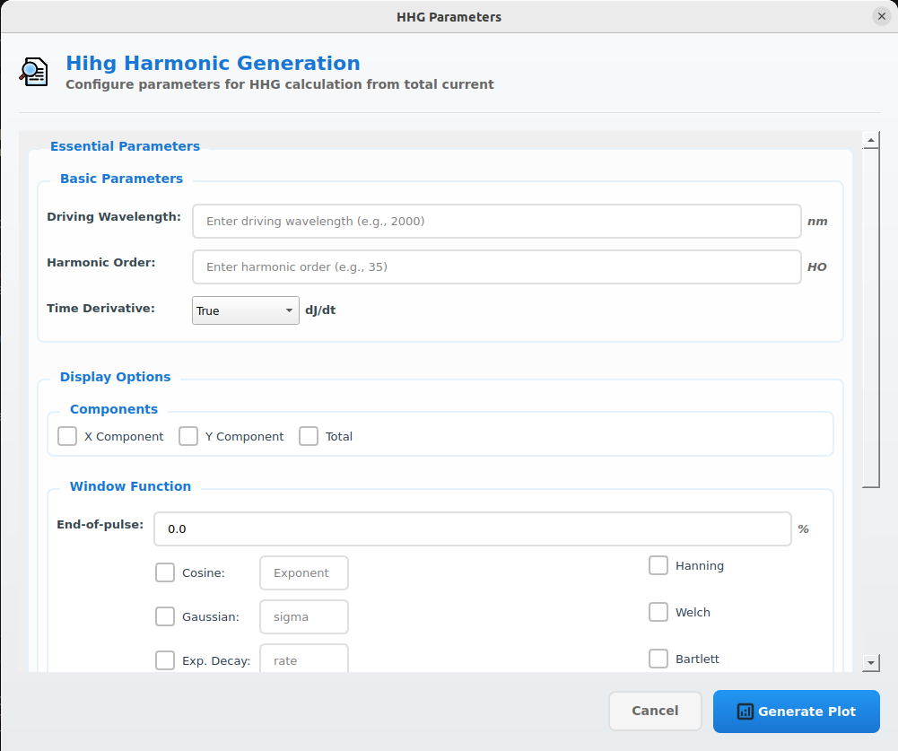
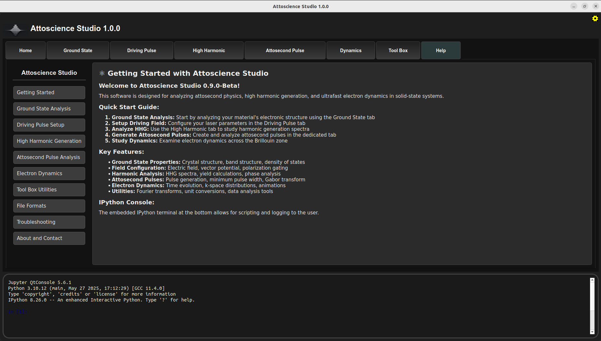

# Attoscience Studio

<div align="center">


**A comprehensive PyQt5-based scientific software suite for ultrafast light–matter interaction analysis**

Specialized in attosecond pulse generation and high harmonic generation (HHG) from solid-state materials

[Installation](#installation) • [Features](#features) • [Screenshots](#screenshots) • [Documentation](#documentation) • [Contributing](#contributing)

</div>

---

## Overview

**Attoscience Studio** is a interactive analysis and visualization platform designed for researchers working with ultrafast laser-matter interactions. The software seamlessly integrates with TDDFT simulation results (e.g., from Octopus) and provides tools for:

- **Electronic structure analysis** of crystalline materials
- **Laser pulse configuration** and polarization gating design  
- **High harmonic generation** spectral analysis
- **Attosecond pulse synthesis** and characterization
- **Ultrafast electron dynamics** visualization
- **Mathematical tools** for signal processing

---

## Features

### Ground State Analysis
- **Crystal Structure Visualization**: Examine atomic arrangements in crystal lattices
- **Electronic Band Structure**: Analyze energy dispersion relations with automatic band gap calculation (direct/indirect)
- **Density of States (DOS)**: Visualize electronic state distributions as a function of energy
- **Electron Density Mapping**: Study spatial probability distributions of electrons in materials

### Laser Field Configuration
- **Single & Dual Pulse Setup**: Configure Ex, Ey, Ez components for complex field geometries
- **Vector Potential Analysis**: Time-dependent gauge field calculations (E = -∂A/∂t)
- **Polarization Gating**: Design isolated attosecond pulse generation schemes with precise control over:
  - Laser wavelength, intensity, and optical cycles
  - Ellipticity and rotation angles
  - Carrier envelope phase (CEP)
  - Temporal delays between pulses
  - Sine-square or Gaussian pulse envelopes
- **Gate Width Optimization**: Calculate time-dependent ellipticity ε(t) for optimal gating

### High Harmonic Generation Analysis
- **Time-Domain Total Current Visualization**: Monitor induced currents (jx, jy, jz) during laser-matter interaction
- **HHG Spectral Analysis**: Fourier transform analysis with both velocity and acceleration forms
```math
\mathrm{HHG}(\omega) = \left| \mathcal{F} \left( \frac{\partial}{\partial t} \int_{\Omega} d^3r \, \mathbf{J}(\mathbf{r}, t) \right) \right|^2
```
- **Harmonic Yield Calculations**: Quantify emission efficiency for specific harmonic orders
```math
I_{HO, i}(n) = \left| \int_{\omega_i}^{\omega_f} e^{i \omega t} \, \mathrm{HHG}(\omega) \, d\omega \right|^2
```
- **Phase Analysis**: Extract phase information from harmonic components in radians and degrees
- **Ellipticity Measurements**: Determine circular polarization characteristics of generated harmonics
```math
The ellipticity is defined as:  
$$
\varepsilon = \frac{|a_+| - |a_-|}{|a_+| + |a_-|}
$$  
where:  
$$
a_+ = \frac{1}{\sqrt{2}} (F_i + i F_j)
$$  
$$
a_- = \frac{1}{\sqrt{2}} (F_i - i F_j)
$$  
and $F_i$, $F_j$ are the Fourier components of the harmonic field.
```
- **Cutoff Energy Predictions**: Identify maximum photon energies and plateau structures
### Attosecond Pulse Generation & Characterization
- **Attosecond Pulse Intensity**:  
```math
I(t) = \left| \int_{(n - 1) \omega}^{(n + 1) \omega} \mathrm{HHG}(\omega^\prime) \, d\omega^\prime \right|^2
```
- **Minimum Pulse Width (FWHM) Optimization**: Find shortest achievable pulse durations
- **Gabor Transform Analysis**:
```math
G(t, \omega) = \int j(\tau) , g(\tau - t) , e^{-i \omega \tau} , d\tau
```
```math
g(t) = \exp\left(-\frac{t^2}{2\sigma^2}\right)
```
### Ultrafast Electron Dynamics
- **Time-Resolved Excitation Tracking**: Monitor excited electron populations over optical cycles
- **Brillouin Zone Mapping**: Visualize k-space distributions of excited electrons and currents
- **Real-Time Animations**: Generate smooth time-evolution movies with:
  - Customizable grid resolution and interpolation
  - Multithreaded processing for responsive UI
  - Export capabilities for presentations
- **Preferential Direction Analysis**: Identify anisotropic excitation patterns

### Mathematical Toolbox
- **Fourier Transform Suite**: 
  - Function-based transforms with user-defined expressions
  - Data file processing with cubic interpolation
  - Inverse transforms for signal reconstruction
- **Unit Conversion System**: Seamless conversion between SI and atomic units for:
  - Intensity (W/cm² ↔ a.u.)
  - Time (seconds ↔ a.u.)
  - Energy (eV ↔ Hartree)
  - Electric fields (V/m ↔ a.u.)
  - Length (meters ↔ Bohr radius)

### Advanced Integration
- **Embedded IPython Console**: Full Python scripting environment for custom analysis
- **Flexible File Format Support**: Compatible with standard TD-DFT output formats
- **High-Performance Visualization**: Matplotlib integration with publication-ready plots
- **Memory-Efficient Processing**: Optimized algorithms for large dataset handling

### User Experience
- **Intuitive Tabbed Interface**: Organized workflow from ground state to attosecond analysis
- **Comprehensive Help System**: Built-in documentation with examples and best practices
- **Real-Time Parameter Feedback**: Immediate visualization of parameter changes
- **Error Handling & Validation**: Robust input checking with helpful error messages

---

## Screenshots

<div align="center">

| Main Interface | Band Structure Analysis |
|:-------------:|:----------------------:|
|  |  |
| *Complete tabbed interface for comprehensive analysis* | *Electronic band structure with automatic gap detection* |

| Electron Dynamics | Animation Controls |
|:----------------:|:------------------:|
|  |  |
| *Real-time visualization of electron current evolution* | *Customizable animation settings and export options* |

| HHG Spectral Analysis | Integrated Help System |
|:--------------------:|:----------------------:|
|  |  |
| *High harmonic generation spectrum configuration* | *Comprehensive built-in documentation* |

</div>

---

## Installation

### System Requirements

- **Operating System**: Linux (recommended)
- **Python Version**: 3.8 or higher
- **Memory**: 4GB RAM minimum, 8GB+ recommended
- **Storage**: 1GB free space
- **Graphics**: OpenGL support for visualizations

### Quick Installation

#### Option 1: From Source (Recommended)

```bash
# Clone the repository
git clone https://github.com/erfan-h/attoscience_studio.git
cd attoscience_studio

# Install dependencies and the package
pip install .
```

#### Option 2: Development Installation

```bash
# For developers who want to modify the code
git clone https://github.com/erfan-h/attoscience_studio.git
cd attoscience_studio
pip install -e .
```

### Dependencies

All required dependencies are listed in `requirements.txt` and will be automatically installed:

- PyQt5 (GUI framework)
- NumPy & SciPy (numerical computing)
- Matplotlib (plotting and visualization)
- IPython (interactive console)

### Verification

After installation, verify everything works correctly:

```bash
# Launch the application
attoscience-studio

# Or run from Python
python -m attoscience_studio
```

---

## Documentation

### Getting Started

1. **Load Your Data**: Start with ground state analysis using your TD-DFT output files
2. **Configure Laser Fields**: Set up driving pulses and polarization gating parameters
3. **Analyze HHG**: Generate and study high harmonic spectra
4. **Generate Attosecond Pulses**: Synthesize and optimize ultrashort pulses
5. **Visualize Dynamics**: Create animations of electron motion in k-space

### Supported File Formats

- **Crystal Structure**: parser.log file generated by Octopus and conventional standard CIF
- **Band Structure**: Standard Octopus output format 'bandstructure'
- **Density of States**: Energy-resolved DOS data 
- **Electron Density**: Standard Octopus output format 'density.x=0' or 'density.y=0' or 'density.z=0'
- **Laser Data**: Electric field and vector potential files ('laser' file generated by Octopus)
- **Total current data**: High harmonic generation and attosecond pulses ('total_current' file generated by Octopus)
- **Current Data**: Momentum-resolved current components ('current_kpt-x.kz=0')
- **Number of Excited Electrons Data**: Momentum-resolved nex ('n_excited_el_kpt.kz=0')

### Built-in Help

Attoscience Studio includes comprehensive help documentation accessible through the interface, covering:

- Step-by-step tutorials for each analysis type
- File format specifications
- Parameter explanations and best practices
- Troubleshooting guide

---

## Contributing

We welcome contributions from the scientific community! Here's how you can help:

### Ways to Contribute

-  **Report Bugs**: Open an issue with detailed reproduction steps
-  **Suggest Features**: Propose new analysis tools or improvements
-  **Improve Documentation**: Help make our docs clearer and more comprehensive
-  **Submit Code**: Fix bugs or implement new features

### Development Setup

```bash
# Fork the repository on GitHub
git clone https://github.com/YOUR_USERNAME/attoscience_studio.git
cd attoscience_studio

# Create a development environment
python -m venv venv
source venv/bin/activate  # On Windows: venv\Scripts\activate

# Install in development mode
pip install -e ".[dev]"
```

### Coding Standards

- Follow PEP 8 style guidelines
- Include docstrings for all functions and classes
- Add unit tests for new features
- Update documentation for user-facing changes

---

## License

This project is licensed under the GPL-3.0 License - see the [LICENSE](LICENSE) file for details.

---

## Acknowledgments

This software builds upon research computational physics. We acknowledge the contributions of:

- Developers of Octopus

---

## Contact & Support

- **Issues & Bug Reports**: [GitHub Issues](https://github.com/erfanheydari2000/Attoscience-Studio/issues)
- **Feature Requests**: [GitHub Discussions](https://github.com/erfanheydari2000/Attoscience-Studio/discussions)
- **Email**: <erfan.heydari@modares.ac.ir>


---

<div align="center">

</div>
